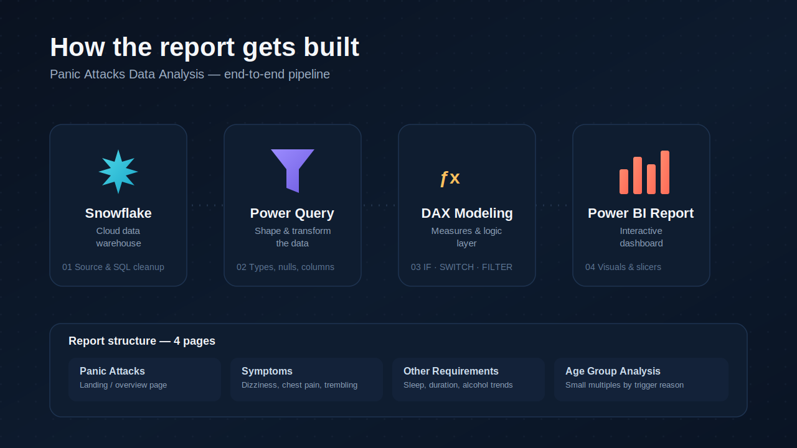
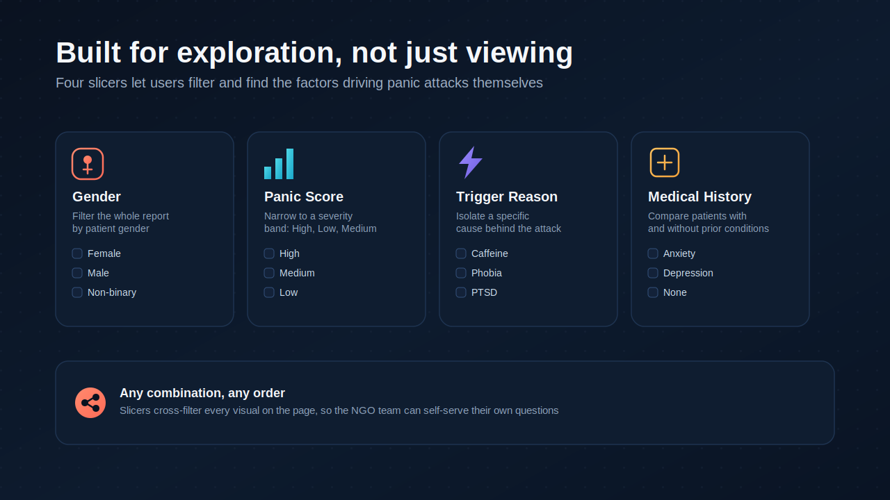
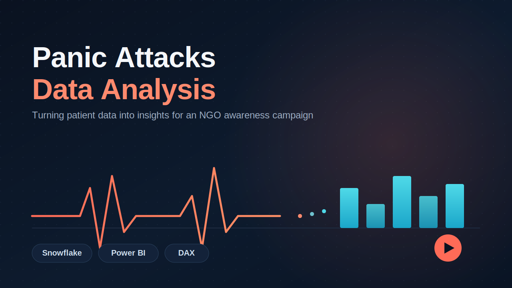

# Panic Attacks Data Analysis — Power BI

An end-to-end **Power BI data analytics project** built around a real-world style NGO scenario. The objective was to analyze patient-level data related to panic attacks and transform it into an interactive dashboard that helps identify **common symptoms, possible triggers, lifestyle patterns, and differences across age groups**.

The project demonstrates a complete BI workflow from **Snowflake and Power Query data preparation to DAX modeling and interactive Power BI visualization**.

---

## 🔗 Project Links

* 📊 **Live Power BI Report:**
  https://app.powerbi.com/groups/me/reports/f1b93e66-c644-4b39-b401-0036cc425afb/f4d7bb8a0f720b705ffc?experience=power-bi

* 💻 **GitHub Repository:**
  https://github.com/dev-kamal-jeet/panic-attacks-data-analysis

* 💼 **LinkedIn:** Add your LinkedIn profile link here

---

## 📌 Business Scenario

An NGO is planning an awareness campaign around panic attacks and wants to better understand the patterns within its patient data.

As the data analyst, the objective was to explore:

* Which symptoms are most commonly reported?
* What triggers are associated with panic attacks?
* How do sleep patterns vary across different groups?
* How do panic scores and attack frequency differ by age group?
* How can users interactively explore the data based on gender, trigger, medical history, and panic score?

The final Power BI report converts the raw patient data into an interactive analytical experience.

---

## 🎯 Project Objectives

The main objectives of this project were to:

* Understand and prepare patient-level data
* Perform data transformation and cleaning
* Create calculated columns and DAX measures
* Analyze common panic-attack symptoms
* Compare lifestyle and behavioral factors
* Segment patients into meaningful age groups
* Analyze panic scores and attack frequency
* Build interactive and user-friendly Power BI reports
* Present insights that could support an awareness campaign

---

## 🗂️ Dataset

The dataset contains **patient-level information related to panic attacks**.

### Main Fields

| Category                   | Fields                                                                     |
| -------------------------- | -------------------------------------------------------------------------- |
| Patient Information        | ID, AGE, GENDER                                                            |
| Health Metrics             | HEART_RATE, PANIC_SCORE                                                    |
| Sleep & Attack Information | SLEEP_HOURS, DURATION_MINUTES, PANIC_ATTACK_FREQUENCY                      |
| Triggers                   | TRIGGER_REASON                                                             |
| Medical Information        | MEDICAL_HISTORY, MEDICATION                                                |
| Lifestyle                  | ALCOHOL_CONSUMPTION, CAFFEINE_INTAKE, EXERCISE_FREQUENCY, SMOKING, THERAPY |
| Symptoms                   | DIZZINESS, CHEST_PAIN, TREMBLING, SWEATING, SHORTNESS_OF_BREATH            |

The dataset contains **22 original columns**, with additional calculated fields created during the Power BI modeling process.

---

# 🔄 Data Analytics Workflow

```text
Raw Patient Data
       ↓
   Snowflake
       ↓
Data Exploration / SQL
       ↓
   Power Query
       ↓
Data Cleaning & Transformation
       ↓
   Data Modeling
       ↓
      DAX
       ↓
Power BI Visualizations
       ↓
Interactive Dashboard
```

---

## 🛠️ Tech Stack

| Tool              | Purpose                                                               |
| ----------------- | --------------------------------------------------------------------- |
| **Snowflake**     | Cloud data warehouse and SQL-based data exploration                   |
| **Snowflake SQL** | Data querying and initial data analysis                               |
| **Power Query**   | Data cleaning and transformation                                      |
| **DAX**           | Calculated columns and analytical measures                            |
| **Power BI**      | Data modeling, visualization, dashboard development and interactivity |

---

# 🧹 Data Transformation

Power Query was used to prepare the dataset before building the analytical model.

Key transformation activities included:

* Correcting data types
* Standardizing field values
* Handling/replacing inconsistent values
* Sorting and organizing data
* Creating conditional columns
* Preparing categorical fields for analysis
* Converting symptom-related fields into analysis-ready values

The transformed data was then used for Power BI modeling and visualization.

---

# 🧮 DAX & Data Modeling

DAX was used to create calculated fields and measures required for segmentation and analysis.

### Key DAX Concepts Used

* `IF`
* `SWITCH`
* `COUNTROWS`
* `FILTER`
* `DIVIDE`
* Calculated columns
* Measures
* Conditional segmentation

### Example Measure

The following measure calculates the percentage of patients reporting dizziness:

```DAX
% Patients Dizziness =
DIVIDE(
    COUNTROWS(
        FILTER(
            'PANIC_ATTACK_DATA',
            'PANIC_ATTACK_DATA'[DIZZINESS] = 1
        )
    ),
    COUNTROWS('PANIC_ATTACK_DATA'),
    0
)
```

`DIVIDE()` was used instead of direct division to safely handle cases where the denominator could be zero.

---

# 📊 Dashboard Structure

The Power BI report contains **four pages**.

## 1. Panic Attacks — Overview

The landing page introduces the project and provides an overview of the panic-attack analysis.

---

## 2. Number of Patients by Symptoms

This page focuses on the most common symptoms reported by patients.

### Symptoms analyzed:

* Dizziness
* Trembling
* Chest Pain
* Sweating
* Shortness of Breath

The visualizations make it easy to compare the number of patients who reported each symptom.

### Key observation

**Sweating appears as the most commonly reported symptom**, followed by **shortness of breath** among the symptoms analyzed.

---

## 3. Other Requirements

This page explores additional lifestyle and panic-attack characteristics.

### Visualizations include:

* Sleep Hours
* Panic Attack Duration
* Alcohol Consumption

### Interactive filters:

* **Panic Score**

  * High
  * Medium
  * Low

* **Gender**

  * Female
  * Male
  * Non-binary

* **Trigger Reason**

  * Caffeine
  * Phobia
  * PTSD
  * Social Anxiety
  * Other available categories

* **Medical History**

  * Anxiety
  * Depression
  * None
  * Other available categories

The slicers allow users to explore different combinations of patient characteristics and dynamically analyze the visuals.

---

## 4. Age Group Analysis

The final page uses **small multiples** to compare patient characteristics across trigger reasons and age groups.

### Trigger Reasons

* Caffeine
* Phobia
* PTSD
* Social Anxiety

### Age Groups

* Adolescent
* Adult

### Metrics Compared

* Average Sleep Hours
* Average Panic Score
* Average Panic Attack Frequency

This allows the same analytical measures to be compared across multiple trigger and age-group combinations within a single report page.

---

# 🔍 Key Insights

Some notable observations from the dashboard include:

### 🟢 Symptoms

* **Sweating** was the most frequently reported symptom among the five symptoms analyzed.
* **Shortness of breath** was also reported by a large proportion of patients.
* **Chest pain** had a lower reported frequency compared with the other analyzed symptoms.
* Dizziness showed a relatively balanced distribution between patients reporting and not reporting the symptom.

### 🟢 Trigger & Age Analysis

The age-group analysis showed differences in average panic scores and attack frequency across trigger reasons.

* Adult patients associated with **PTSD and Social Anxiety** showed relatively higher average panic scores than some other trigger groups.
* **Caffeine-triggered adolescents** showed a relatively high average panic-attack frequency.
* Average sleep hours remained within a relatively narrow range across the groups displayed in the report.

> These observations describe patterns in the dataset and should not be interpreted as medical conclusions or causal relationships.

---

# 🎛️ Dashboard Interactivity

The report was designed to allow users to explore the data instead of viewing static charts.

Users can combine multiple slicers to investigate questions such as:

> What does the symptom distribution look like for a particular gender?

> How does panic-related information change for patients with a specific medical history?

> How do different trigger reasons compare for high, medium, or low panic scores?

> How do adolescents and adults differ across different trigger reasons?

The slicers cross-filter the relevant visuals, making the report interactive and exploratory.

---

# 📈 Key Power BI Techniques

This project demonstrates practical Power BI skills including:

* Data loading and exploration
* Power Query transformations
* Data type management
* Conditional columns
* DAX calculated columns
* DAX measures
* Conditional calculations
* Percentage calculations
* `COUNTROWS()` and `FILTER()`
* Safe division using `DIVIDE()`
* `IF()` and `SWITCH()`
* Slicers
* Cross-filtering
* Clustered column/bar charts
* Line charts
* Area/step-style visualizations
* Small multiples
* Dashboard layout and design
* Interactive report development

---

# 📁 Repository Files

| File                                        | Description                                   |
| ------------------------------------------- | --------------------------------------------- |
| `panic-attacks-data-analysis.pbix`          | Power BI report file                          |
| `panic-attacks-data-analysis-thumbnail.png` | Project thumbnail / cover image               |
| `panic-attacks-process-overview.png`        | Data analytics pipeline / technology overview |
| `panic-attacks-slicers-slide.png`           | Dashboard slicers and interactivity overview  |

---

# 🖼️ Project Preview

### Process Overview



### Dashboard Interactivity



### Project Thumbnail



---

# 💡 What This Project Demonstrates

This project demonstrates my ability to work through an end-to-end **Business Intelligence and Data Analytics workflow**:

**Data → Transformation → Modeling → DAX → Visualization → Insights**

Rather than focusing only on creating charts, the project focuses on transforming raw patient-level data into an interactive report that allows users to explore patterns and compare different segments.

---

# 🚀 How to Explore the Project

### Option 1 — Power BI Report

Open the live Power BI report:

https://app.powerbi.com/groups/me/reports/f1b93e66-c644-4b39-b401-0036cc425afb/f4d7bb8a0f720b705ffc?experience=power-bi

### Option 2 — PBIX File

Download or clone this repository and open:

```text
panic-attacks-data-analysis.pbix
```

using **Microsoft Power BI Desktop**.

---

# 📚 Skills Demonstrated

**Data Analytics | SQL | Snowflake | Power Query | DAX | Power BI | Data Cleaning | Data Modeling | Data Visualization | Dashboard Development | Business Intelligence**

---

# 👨‍💻 Connect

**GitHub:**
https://github.com/dev-kamal-jeet

**LinkedIn:**
Add your LinkedIn profile link here

---

## ⭐ If you find this project useful

Feel free to explore the repository and the Power BI report.
